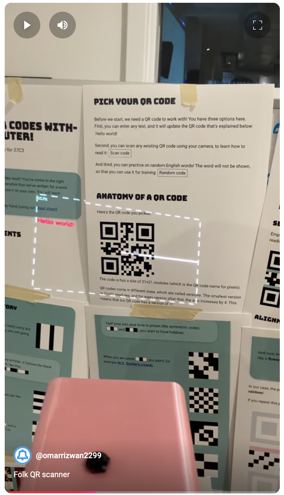
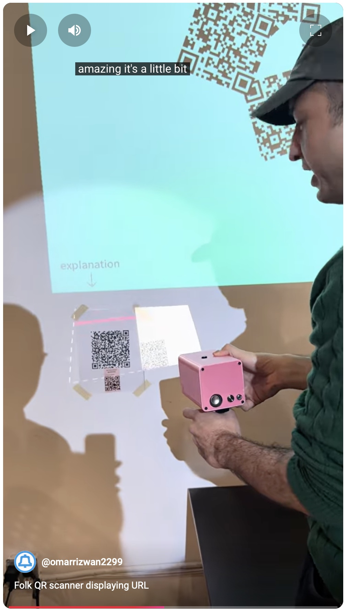
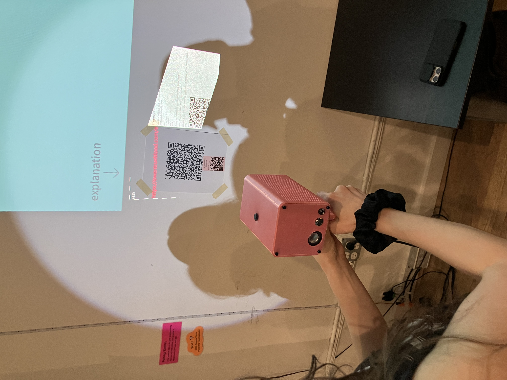

# folk-qr

Hacked together in a couple of hours before [QR
Show](https://qrshow.nyc).

Point a Folk gadget/system at a QR code, press the trigger button, and
it'll scan and display the QR code decode result and render URL on the
right half of the gadget display.

**Decoding a QR code that just contains "Hello world!":**

([video](https://youtube.com/shorts/LZnhJCdZSVA))

**Viewing a URL (URL thanks to
[Owen](https://owentrueblood.com/experiments/autonomous_response/), video thanks to [Kelin](https://www.carolynzhang.com)):**

 

([video](https://youtube.com/shorts/2yj2y554O5g))

No need for a phone, and people around you can see and participate in
what you're doing too, they don't need to pull out their own
individual phones to see what the QR code is.

## Dependencies

Install the `wkhtmltopdf` package (we need `wkhtmltoimage` available).

Install ZBar scanning library (I was using quirc before, but ZBar
seems much more reliable): `sudo apt install libzbar-dev`

## License

Apache 2.0

## Notes

- Doesn't require calibration or any AprilTags!

- Kind of hard-coded to the gadget: assumes 720p projection, `Claim
  the button is pressed` statement to trigger
  - On my Orange Pi 5 gadget, I have this in `setup.folk` to establish
    button state:

        exec gpio mode 7 up
        When the clock time is /t/ {
            set pressed [expr {![exec gpio read 7]}]
            Claim the button is [expr {$pressed ? "pressed" : "unpressed"}]
        }

- ~~System freezes while doing URL download and rendering, would be good
  to do async and timeout (sometimes it freezes indefinitely if the
  page is too complex, which is scary and makes me paranoid when
  scanning untested URLs)~~

- ~~(Unlike phone QR detect that runs continuously), for now only has
  one shot per button press to do QR detect. Often not reliable based
  on lighting/print quality/etc. Would be good to just keep retrying
  each frame until you get a QR code~~

- TODO: scan wifi qrs, scan program qrs

- ~~replace qr code library with zbar or something OR improve
  stability of camera image? OR **pre-binarize image** (worked when
  done manually in imagemagick) before feeding to quirc~~
